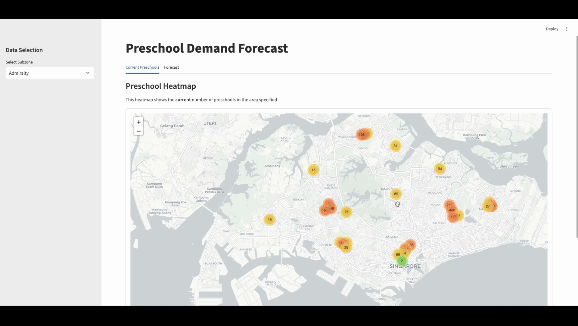
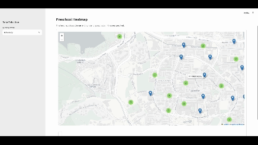

# Preschool Allocation Forecast

This repository provides the necessary files to deploy a web application designed to facilitate the understanding and forecasting of preschool allocations across Singapore. The application is intended to support the Early Childhood Development Agency (ECDA) in optimizing the planning and distribution of preschools.

## Project Overview

The primary objective of this project is to forecast the demand for preschool services at the subzone level, specifically targeting children aged 18 months to 6 years, for the upcoming five years. This forecast will assist ECDA in making informed decisions regarding the planning and relocation of preschools.

## Features

* A comprehensive Streamlit web application with both back-end and front-end components.

<p align="center">
    
    
</p>

## Setup

1. Clone this repository:
    ```bash
    git clone git@github.com:shingurding/preschool-allocation-forecast.git

    # Navigate to this folder
    cd preschool-allocation-forecast/
    ```

2. Create and activate a virtual environment:
    ```bash
    python -m venv .venv

    # On macOS or Linux
    source .venv/bin/activate

    # On Windows
    .venv\Scripts\activate
    ```

3. Install the required packages:
    ```bash
    pip install -r requirements.txt
    ```

## Running the app

To start the Streamlit application on your local machine, execute the following command:
```bash
streamlit run app.py
```

## Repository Structure

```css
.
├── data/
│    ├── 2000-Table.parquet
│    ├── 2001-2010-Table.parquet
│    ├── 2011-2019-Table.parquet
│    ├── 2020-Table.parquet
│    ├── 2020-Table.parquet
│    ├── BirthsAndFertilityRatesAnnual.parquet
│    ├── btomapping.parquet
│    ├── ListingofCentres.parquet
│    ├── MasterPlan2019SubzoneBoundaryNoSea.parquet
│    └── SG_postal.parquet
├── app.py
├── utils.py
├── forecast_model.py
├── data_cleaning.ipynb
```